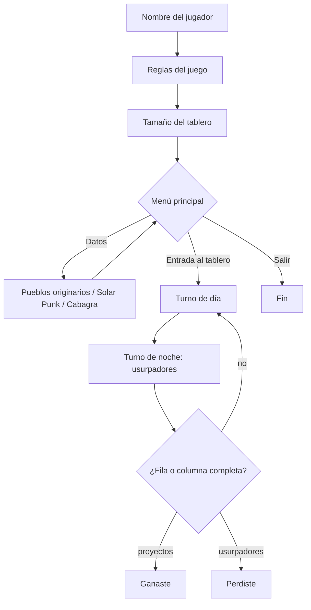

# Proyecto Taller 3

Juego de estrategia por turnos en consola, ambientado en la región ficticia de "Topuria" y hecho en Python para el curso **Taller de Programación**. El jugador basicamente defiende un territorio representado por un tablero: de día crea proyectos, iniciativas y actividades culturales, y de noche los usurpadores intentan quedarse con el territorio.


---

## Tabla de Contenidos
- [Características](#características)
- [Autores](#autores)
- [Reglas del Juego](#reglas-del-juego)
- [Arquitectura](#arquitectura)
- [Tecnologías](#tecnologías)
- [Estructura del Proyecto](#estructura-del-proyecto)
- [Cómo Ejecutar](#cómo-ejecutar)
- [Qué Aprendí](#qué-aprendí)

---

## Características
* Tablero cuadrado de tamaño variable (de 1x1 hasta 24x24) con filas por letra y columnas por número.
* Turnos alternados de día (jugador) y noche (usurpadores aleatorios).
* Tres acciones para el jugador: iniciativa, proyecto y actividad cultural, esta última con expansión por fila o columna.
* Condiciones de victoria y derrota revisadas después de cada turno.
* Menú principal con datos informativos, con referencias, sobre pueblos originarios, Solarpunk y Cabagra.
* Validación de todas las entradas del usuario (nombre de máximo 15 caracteres, tamaño del tablero, opciones, fila y columna).
* Arte ASCII en la bienvenida, el tablero, los menús y las pantallas de victoria, derrota y salida.

---

## Autores
* Jervis Fabricio Esquivel Solano
* Christopher Daniel Vargas Villalta, 2024108443

**Curso:** Taller de Programación

**Profesor:** Marco Aurelio Sanabria Rodriguez

---

## Reglas del Juego
El tablero se muestra con estos símbolos:

| Símbolo | Significado |
|---------|-------------|
| ` ` | Espacio vacío |
| `I` | Iniciativa |
| `P` | Proyecto |
| `A` | Actividad cultural |
| `U` | Usurpador |

**Turno de día (jugador)**: elige una acción y una casilla (por ejemplo fila `B`, columna `3`).

| Acción | Dónde se puede colocar |
|--------|------------------------|
| Iniciativa | Espacio vacío o actividad cultural |
| Proyecto | Espacio vacío, iniciativa, actividad cultural o usurpador |
| Actividad cultural | Solo espacio vacío; luego se expande por la fila o la columna hasta toparse con una casilla ocupada |

**Turno de noche (usurpadores)**: se elige al azar una fila o una columna y se colocan de 2 a 6 usurpadores sobre espacios vacíos o proyectos.

**Fin del juego**
* **Ganas** si completas una fila o columna entera de proyectos.
* **Pierdes** si los usurpadores completan una fila o columna entera.

---

## Arquitectura
Programa de consola secuencial en un solo archivo, con funciones para cada parte del juego y ciclos `while` para validar las entradas y alternar los turnos. El tablero es una matriz (lista de listas) de números donde cada valor representa un tipo de casilla (`0` vacío, `1` iniciativa, `2` proyecto, `3` actividad cultural, `4` usurpador).



---

## Tecnologías
* Python 3

---

## Estructura del Proyecto
`Final.py` contiene el juego completo. El resto de archivos son los módulos con los que se desarrolló por partes; al intentar unirlos con `import` no funcionaron, por lo que todo se consolidó en `Final.py`.

```text
Proyecto-Programado-3/
├── Final.py                  # Juego completo (ejecutar este)
├── ASCII.py                  # Arte ASCII usado por el juego
├── Datos.py                  # Textos informativos (pueblos originarios, Solar Punk, Cabagra)
├── Inicializacion.py         # Nombre del jugador y validación
├── Menu.py                   # Primer borrador del menú principal
├── Territorio.py             # Creación y validación del tablero
├── Turnos.py                 # Turno de día y revisión de ganador/perdedor
├── Proyectos_Usurpadores.py  # Lógica de los usurpadores
├── Menu_turnos.py            # Archivo vacío
└── README.md
```

---

## Cómo Ejecutar

### Requisitos previos
* Python 3.8+
* Una terminal con soporte UTF-8 (el arte ASCII usa caracteres de bloque). En PowerShell de Windows ejecutar `chcp 65001` antes si el arte se ve mal.

### Inicio rápido
```bash
python Final.py
```

### Guía de uso
1. Ingresar el nombre (máximo 15 caracteres).
2. Ingresar el tamaño del tablero (de 1 a 24).
3. En el menú principal, leer los datos de las comunidades o elegir la opción 1 para entrar al tablero.
4. En cada turno de día elegir una acción (1, 2 o 3), una fila (letra) y una columna (número).
5. Seguir jugando hasta ganar o perder.

### Notas
* Los scripts se ejecutan de arriba hacia abajo y leen datos con `input()`, por lo que se deben ejecutar directamente, no importar.
* Los módulos sueltos (`Turnos.py`, `Territorio.py`, etc.) son borradores y no funcionan por separado; usar siempre `Final.py`.

---

## Qué Aprendí
* A dividir un programa grande en funciones con una sola responsabilidad (validar, crear el tablero, turno de día, turno de noche, revisar el ganador).
* A modelar un tablero con una matriz y a validar entradas del usuario antes de usarlas (letras, números y rangos).
* Que dividir el proyecto en archivos requiere manejar bien los `import`; con más tiempo organizaría el juego en módulos reales en lugar de un único `Final.py`.
